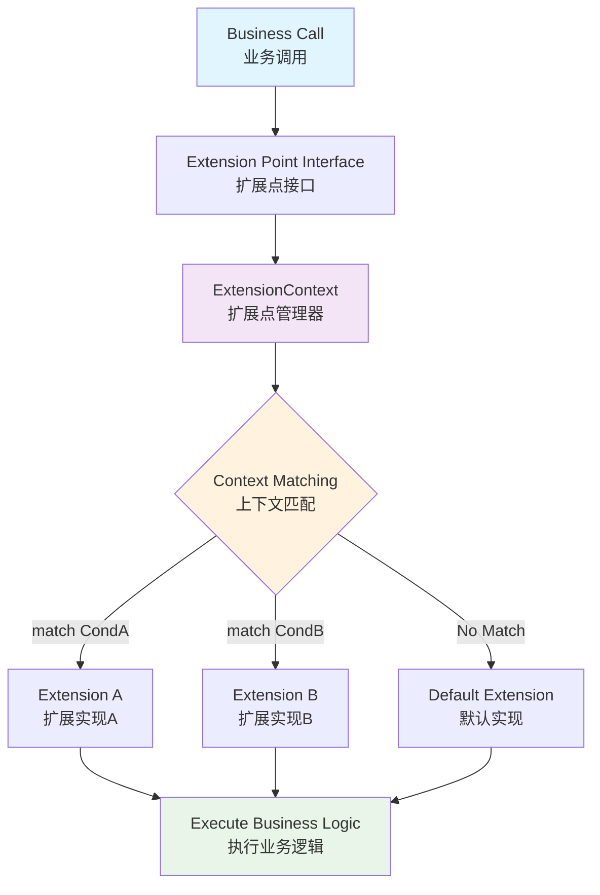

# Extension Framework

一个轻量级、易用的Java扩展点框架，专为解决复杂业务系统的扩展性问题而设计。通过定义扩展点接口和实现动态匹配机制，实现系统通用流程与业务特殊逻辑的完美解耦。

[📖 English Documentation](README-EN.md) | 📖 中文文档

## 🏗️ 框架架构



## ✨ 核心特性

- **轻量级**：最小化依赖，专注核心功能
- **简洁易用**：核心API只有几个类，5分钟上手
- **渐进式复杂度**：从简单到复杂，按需使用高级特性
- **Spring友好**：与Spring Boot无缝集成，支持依赖注入

## 🚀 快速开始

### Maven依赖

**Spring Boot项目（推荐）：**
```xml
<dependency>
    <groupId>io.github.qoggy</groupId>
    <artifactId>extension-spring-boot-starter</artifactId>
    <version>1.0.2</version>
</dependency>
```

**纯Java项目：**
```xml
<dependency>
    <groupId>io.github.qoggy</groupId>
    <artifactId>extension-core</artifactId>
    <version>1.0.2</version>
</dependency>
```

### 5分钟快速示例

#### 1. 定义扩展点
```java
// 业务扩展点接口
interface PaymentProcessor {
    PayResult processPayment(Order order);
}

// 上下文对象
class PaymentContext {
    private String paymentType;
    // getter/setter...
}
```

#### 2. 实现扩展
```java
// 使用@Extension注解标记扩展实现
@Extension
class AlipayProcessor implements PaymentProcessor, Matcher<PaymentContext>, Priority {
    @Override
    public PayResult processPayment(Order order) {
        // 支付宝支付逻辑
        return new PayResult("alipay", "success");
    }

    @Override
    public boolean match(PaymentContext context) {
        return "alipay".equals(context.getPaymentType());
    }

    @Override
    public int getPriority() {
        return 10;
    }
}

// 微信实现
@Extension
class WechatProcessor implements PaymentProcessor, Matcher<PaymentContext> {
    @Override
    public PayResult processPayment(Order order) {
        // 微信支付逻辑
        return new PayResult("wechat", "success");
    }

    @Override
    public boolean match(PaymentContext context) {
        return "wechat".equals(context.getPaymentType());
    }
}
```

#### 3. 使用扩展点
```java
@Service
class OrderService {
    @Autowired
    private ExtensionContext extensionContext;
    
    // 自动注入扩展点代理
    @ExtensionInject
    private PaymentProcessor paymentProcessor;

    public PayResult processOrder(Order order) {
        PaymentContext context = new PaymentContext(order.getPaymentType());
        
        try (var ignored = extensionContext.initScope(context)) {
            // 框架自动选择匹配的实现
            return paymentProcessor.processPayment(order);
        }
    }
}
```

## 🌈 纯Java项目使用

### 1. 定义扩展实现
```java
// 支付宝实现（不使用@Extension注解）
class AlipayProcessor implements PaymentProcessor, Matcher<PaymentContext>, Priority {
    @Override
    public PayResult processPayment(Order order) {
        return new PayResult("alipay", "success");
    }

    @Override
    public boolean match(PaymentContext context) {
        return "alipay".equals(context.getPaymentType());
    }

    @Override
    public int getPriority() {
        return 10;
    }
}

// 默认实现
class DefaultPaymentProcessor implements PaymentProcessor, Priority {
    @Override
    public PayResult processPayment(Order order) {
        return new PayResult("default", "failed");
    }

    @Override
    public int getPriority() {
        return Priority.LOWEST_PRECEDENCE;
    }
}
```

### 2. 手动注册和使用

**方式一：直接查找**
```java
class OrderService {
    private static final ExtensionContext extensionContext = new ExtensionContext();
    
    static {
        // 手动注册扩展实现
        extensionContext.register(
            new AlipayProcessor(),
            new DefaultPaymentProcessor()
        );
    }

    public PayResult processOrder(Order order) {
        PaymentContext context = new PaymentContext(order.getPaymentType());
        
        try (var scope = extensionContext.initScope(context)) {
            // 自动选择匹配的实现
            PaymentProcessor processor = extensionContext.find(PaymentProcessor.class);
            return processor.processPayment(order);
        }
    }
}
```

**方式二：代理模式**
```java
class OrderService {
    private static final ExtensionContext extensionContext = new ExtensionContext();
    
    static {
        // 手动注册扩展实现
        extensionContext.register(
            new AlipayProcessor(),
            new DefaultPaymentProcessor()
        );
    }
    
    // 创建代理对象，自动路由到匹配的实现
    private final PaymentProcessor paymentProcessor = extensionContext.proxy(PaymentProcessor.class);

    public PayResult processOrder(Order order) {
        PaymentContext context = new PaymentContext(order.getPaymentType());
        
        try (var ignored = extensionContext.initScope(context)) {
            // 直接调用，框架自动选择实现
            return paymentProcessor.processPayment(order);
        }
    }
}
```

## 📖 核心概念

### ExtensionContext
扩展点管理器，负责扩展实现的注册、查找和上下文管理。

```java
ExtensionContext context = new ExtensionContext();

// 注册扩展实现（直接注册实例）
context.register(new AlipayProcessor(), new WechatProcessor());

// 查找单个实现（优先级最高的匹配实现）
PaymentProcessor processor = context.find(PaymentProcessor.class);

// 查找所有匹配的实现（按优先级排序）
List<PaymentProcessor> processors = context.findAll(PaymentProcessor.class);

// 创建代理对象
PaymentProcessor proxy = context.proxy(PaymentProcessor.class);

// 管理上下文作用域
try (ExtensionScope scope = context.initScope(contextObject)) {
    // 在此作用域内进行扩展点调用
}
```

### Matcher<T>
匹配器接口，用于判断扩展实现是否应该被执行。

```java
public interface Matcher<T> {
    boolean match(T context);
}
```

### Priority
优先级接口，用于控制多个匹配实现的执行顺序。

```java
public interface Priority {
    int HIGHEST_PRECEDENCE = Integer.MIN_VALUE;
    int LOWEST_PRECEDENCE = Integer.MAX_VALUE;
    
    int getPriority();
}
```

## 🎯 高级特性

### 扩展点复用
同一个扩展实现可以服务多个业务场景：

```java
class StandardPriceCalculator implements PriceCalculator, Matcher<OrgContext> {
    @Override
    public boolean match(OrgContext context) {
        // 支持多个组织使用相同实现
        return Arrays.asList("alibaba", "taobao", "tmall").contains(context.getOrgId());
    }

    @Override
    public BigDecimal calculate(Order order) {
        return standardPriceCalculation(order);
    }
}
```

### 默认实现
为扩展点提供兜底实现：

```java
@Extension
class DefaultInventoryProcessor implements InventoryProcessor, Priority {
    @Override
    public void processInventory(Order order) {
        // 默认处理逻辑
    }

    @Override
    public int getPriority() {
        return Priority.LOWEST_PRECEDENCE; // 最低优先级，兜底使用
    }
}
```

### 多实现执行
执行所有匹配的扩展实现：

```java
// 获取所有匹配的通知发送器
List<NotificationSender> senders = extensionContext.findAll(NotificationSender.class);

// 逐个执行通知发送
for (NotificationSender sender : senders) {
    try {
        sender.sendNotification(message);
    } catch (Exception e) {
        // 处理单个发送器的异常，不影响其他发送器
        logger.warn("Failed to send notification via " + sender.getClass().getSimpleName(), e);
    }
}
```
